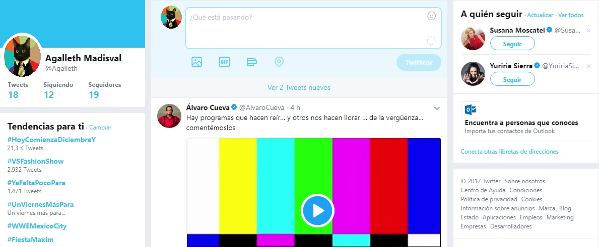
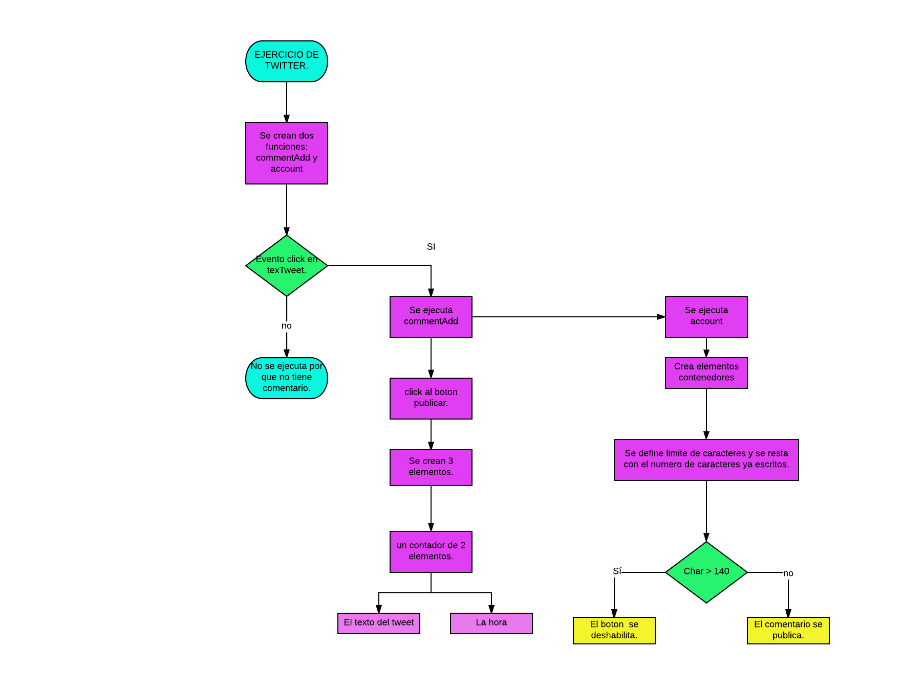

RETO DE CODIGO.
=============================

EJERCICIO DE TWITTER
-----------------------------

Este es el ejercicio de twitter creo por el squad baticoders.
El reto es es replicar el newsfeed de Twitter.

 Versión 0.0.1
-----------------------
   1. Diseñar un formulario que permita ingresar un texto y un botón para "twittear".
   2. Agregar un evento de click al botón o de submit al formulario.
   3. En el evento, obtener el texto.
   4. Agregar el texto al HTML.

 Versión 0.0.2
-------------------
   1. No ingresar texto vacío (deshabilitar el botón de "twittear").
   2. Contar la cantidad de caracteres de forma regresiva.

 Versión 0.0.3
------------------  
   1. Si pasa los 140 caracteres, deshabilitar el botón.
   2. Si pasa los 120 caracteres, mostrar el contador con OTRO color.
   3. Si pasa los 130 caracteres, mostrar el contador con OTRO color.
   4. Si pasa los 140 caracteres, mostrar el contador en negativo.

 Versión 0.0.4
 --------------
   1. Al presionar enter(/n) que crezca el textarea de acuerdo al tamaño del texto.

 Versión 0.0.5 (Extra)
----------------------------   
   1. Si la cantidad de caracteres ingresados (sin dar un enter), supera al tamaño del textarea por defecto, debe de    agregarse una línea más para que no aparezca el scroll. (Si en caso aplica)

  FUNCION DEL EJERCICIO.
  =============================================

  

  DIAGRAMA DE FLUJO.
  =================================================
  

  ACERCA DE JAVASCRIPT.
  ========================================

  Se crearon variables para poder resolver este ejercicio.
  Se crearón eventos que se ejecutaran al textear.
  Se creo un contador de caracteres que se ejecuta cuanto se oprime una tecla para twittear y esta es la que indica que solo se puede usar 140 caracteres.
  El contador cambia de color para indicar al usuario que ya se van a cumplir con la condición de los caracteres indicados. Y en caso de que pase se deshabilita el boton para mandar el twitt.

  Al hacer la declaracion de funciones, son las que evitan que un corte de flujo y proporcionan la mejora de usabilidad del usuario.
  Se hace una creacion de un "div" por medio de js, para que los comentarios que haga el usuario se pueda posicionar
  debajo de los comentarios anteriones, en los cuales tambien se tiene el registro de la fecha y hora.

  Tambien se crean variables para la realización de contenedores que son los que muestran el la pagina los comentarios nuevos con todas las caracteristicas anteriores.
